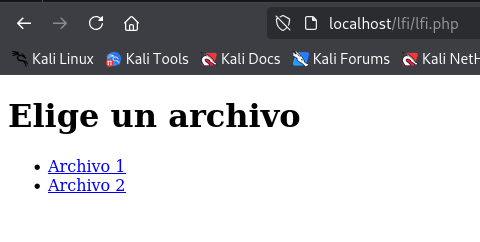
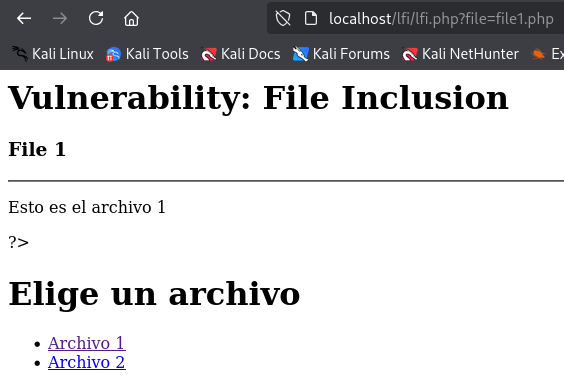
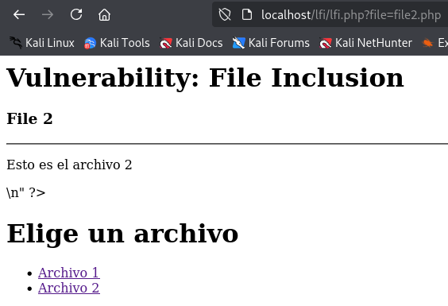
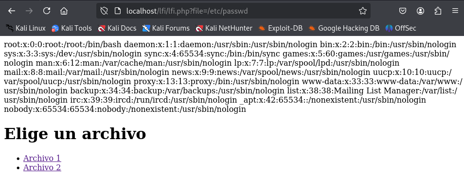
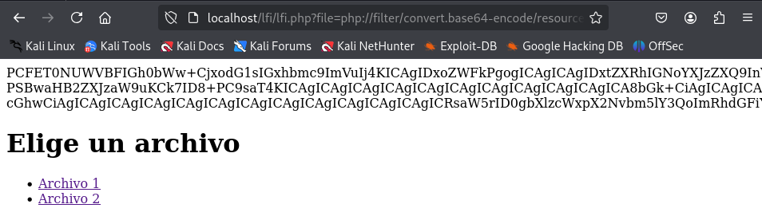
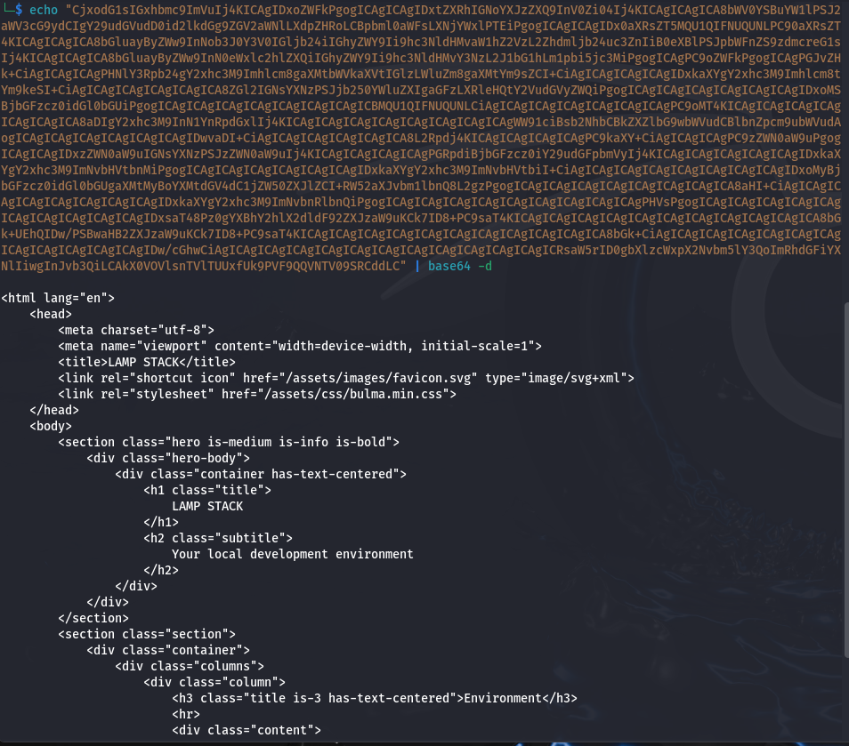
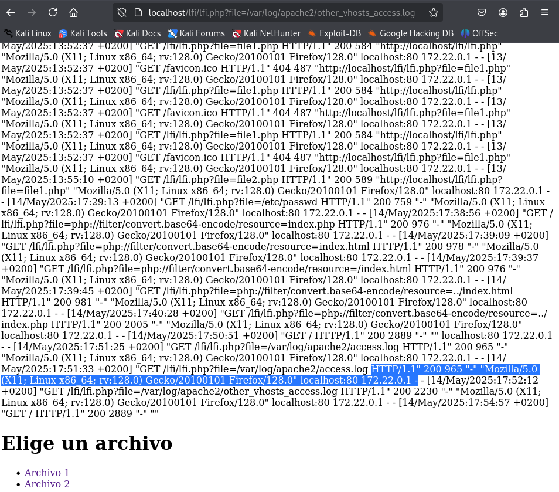
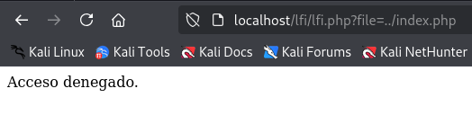
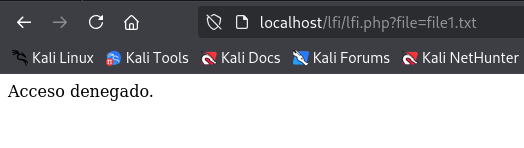

# PPS-Unidad3Actividad8-AdrianCurtoSanchez

## Código vulnerable

Creamos el archivo vulnerable `lfi.php`.

```
<?php

if (isset($_GET['file'])) {
    $file = $_GET['file'];
    echo file_get_contents($file);
}

?>

<!DOCTYPE html>
<html>
<head>
    <meta charset="UTF-8">
    <title>Ejemplo de Enlaces</title>
</head>
<body>
    <h1>Elige un archivo</h1>
    <ul>
        <li><a href="?file=file1.php">Archivo 1</a></li>
        <li><a href="?file=file2.php">Archivo 2</a></li>
    </ul>
</body>
</html>

```


Y creamos otros dos ficheros `file1.php` y `file2.php`.

```
<?php

$page[ 'body' ] .=
<div class=\"body_padded\">
    <h1>Vulnerability: File Inclusion</h1>
    <div class=\"vulnerable_code_area\">
        <h3>File 1</h3>
        <hr />
        <p>Esto es el archivo 1</p>
    </div>
</div>\n"

?>
```



```
<?php

$file[ 'body' ] .=
<div class=\"body_padded\">
    <h1>Vulnerability: File Inclusion</h1>
    <div class=\"vulnerable_code_area\">
        <h3>File 2</h3>
        <hr />
        <p>Esto es el archivo 2</p>
    </div>
</div>\n"

?>
```



## Explotación de LFI

Si reemplazamos en la URL `file1.php` o `file2.php` por `/etc/passwd` podremos obtener los usuarios del sistema.



### Ejecutar código PHP (PHP Wrappers)

Si la máquina estuviera mal securizada en el fichero `php.ini` podría está habilitado el parámetro `allow_url_include = on`.

Estro nos permite obtener los contenidos de los ficheros PHP que sirve el servidor en Base64.

Si introducimos la URL `http://localhost/lfi/lfi.php?file=php://filter/convert.base64-encode/resource=../index.php` en nuestro entorno de pruebas obtenemos lo siguiente:



Copiamos el texto en Base64 y al decodificarlo obtenemos el contenido del fichero:



### Remote Code Execution (RCE) con Log Poisoning

Podemos lanzar comandos cuya ejecución será guardada en los losgs del servidor. Para ello ejecutamos el siguiente comando en la terminal:

```
curl -A "<?php system('whoami'); ?>" http://localhost
```

Accedeiendo a la URL `http://localhost/lfi/lfi.php?file=/var/log/apache2/other_vhosts_access.log` aprobechamos la vulnerabilidad LFI para obtener los datos de los logs. En mi caso parece ser que la ejecución del código PHP a través de la petición en la terminal no ha funcionado.




## Mitigación de LFI

### Usar una Lista Blanca de Archivos Permitidos

La primera mitigación es limitar los archivos a los que se puede acceder creando una lista blanca como muestra el siguiente código:

```
<?php
// Establecemos una lista de archivos que se pueden incluir
$whitelist = ["file1.php", "file2.php"];
if (isset($_GET['file'])) {
        $file = $_GET['file'];
        if (!in_array($file, $whitelist)) {
                die("Acceso denegado.");
        }
        echo file_get_contents($file);
}

?>

<!DOCTYPE html>
<html>
<head>
    <meta charset="UTF-8">
    <title>Ejemplo de Enlaces</title>
</head>
<body>
    <h1>Elige un archivo</h1>
    <ul>
        <li><a href="?file=file1.php">Archivo 1</a></li>
        <li><a href="?file=file2.php">Archivo 2</a></li>
    </ul>
</body>
</html>
```

Al intentar acceder a un archivo no contemplado recivimos la advertencia.


### Bloquear Secuencias de Directorios (../)

Con str_contains verificamos si el nombre del archivo contiene ".." y denegaríamos el acceso.

```
<?php

if (isset($_GET['file'])) {
    $file = $_GET['file'];

        // Verificar si el nombre del archivo contiene ".." (para prevenir LFI)
        if (str_contains($file, '..')) {
            die("Acceso denegado.");
        }    // Normalizamos la ruta para evitar ataques con '../'
        // mostramos contenido del archivo
        echo file_get_contents($file);

}
?>
<!DOCTYPE html>
<html>
<head>
    <meta charset="UTF-8">
    <title>Ejemplo de Enlaces</title>
</head>
<body>
    <h1>Elige un archivo</h1>
    <ul>
        <li><a href="?file=file1.php">Archivo 1</a></li>
        <li><a href="?file=file2.php">Archivo 2</a></li>
    </ul>
</body>
</html>
```



#### Restringir el Tipo de Archivo

Otra posible mitigación es permitir sólo archivos con una determinada extensión.

Por ejemplo si solo queremos permitir archivos .php, filtramos la extensión:

```
<?php
if (isset($_GET['file'])) {
        $file = $_GET['file'];
        // Validar que el archivo tenga la extensión .php
        if (pathinfo($file, PATHINFO_EXTENSION) !== 'php') {
            die("Acceso denegado.");
        }
    echo file_get_contents($file);
}

?>

<!DOCTYPE html>
<html>
<head>
    <meta charset="UTF-8">
    <title>Ejemplo de Enlaces</title>
</head>
<body>
    <h1>Elige un archivo</h1>
    <ul>
        <li><a href="?file=./files/file1.txt">Archivo 1</a></li>
        <li><a href="?file=./files/file2.php">Archivo 2</a></li>
    </ul>
</body>
</html>
```

Copiamos el archivo `file1.php` y le damos la extensión `.txt` con el comando `cp file.php file1.txt`.

Vemos que no nos permite cargar el fichero `file1.txt`.



## Código seguro

El siguiente código sería el adecuado a implementar para evitar LFI:
```
<?php
// Definir el directorio seguro donde están los archivos permitidos
// ejemplo $directorio_permitido = __DIR__ . '/archivos_permitidos/';
$directorio_permitido = './';

// Lista blanca de archivos permitidos
$archivos_permitidos = [
    'file1.php',
    'file2.php'
];

// Verificar si se ha pasado un archivo por parámetro
if (isset($_GET['file'])) {
    $file = $_GET['file'];

    // Validar que el archivo está en la lista blanca
    if (!in_array($file, $archivos_permitidos, true)) {
        die("Acceso denegado.");
    }

    // Obtener la ruta real del archivo
    $ruta_real = realpath($directorio_permitido . $file);

    // Asegurar que la ruta real está dentro del directorio permitido
    if (!$ruta_real || !str_starts_with($ruta_real, realpath($directorio_permitido))) {
        die("Acceso denegado.");
    }

    // Mostrar el contenido del archivo de forma segura
    echo nl2br(htmlspecialchars(file_get_contents($ruta_real)));
}
?>
<!DOCTYPE html>
<html lang="es">
<head>
    <meta charset="UTF-8">
    <title>Ejemplo de Enlaces</title>
</head>
<body>
    <h1>Elige un archivo</h1>
    <ul>
        <li><a href="?file=file1.php">Archivo 1</a></li>
        <li><a href="?file=file2.php">Archivo 2</a></li>
    </ul>
</body>
</html>
```


